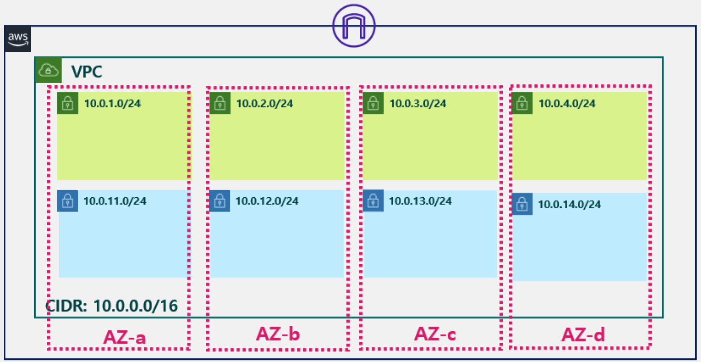

# Info
Terraform VPC Internet Gateway Example



* VPC CIDR 은 10.0.0.0/16 
* Subnet CIDR 은 10.X.0.0/24 
* Subnet 은 본인이 선택한 Region 의 Availability Zone 수 만큼 생성 (ex. us-east-1 -> 4 Availability Zones -> 4 Subnets)
* 각 Availability Zone 별로 Public Subnet, Private Subnet 페어로 한개씩 존재하도록 생성
* Internet Gateway 생성 후 VPC 에 Attach

# Step

## 1. 변수 설정
subnet.tfvars 파일 확인 
실행 환경에 맞게 변경  

```
# subnet.tfvars 파일

prefix              =       "test"
region              =       "us-east-1"
vpc_cidr            =       "10.0.0.0/16"

public_subnets      =       [
    {cidr = "10.0.1.0/24", availability_zone = "us-east-1a"},
    {cidr = "10.0.2.0/24", availability_zone = "us-east-1b"},
    {cidr = "10.0.3.0/24", availability_zone = "us-east-1c"},
    {cidr = "10.0.4.0/24", availability_zone = "us-east-1d"},
]

private_subnets = [
    {cidr = "10.0.11.0/24", availability_zone = "us-east-1a"},
    {cidr = "10.0.12.0/24", availability_zone = "us-east-1b"},
    {cidr = "10.0.13.0/24", availability_zone = "us-east-1c"},
    {cidr = "10.0.14.0/24", availability_zone = "us-east-1d"},
]
```
* Prefix 는 알맞게 변경
* Region 은 본인이 사용할 region 코드로 변경
* Subnet 의 Availability Zone 값은 Region 에 맞게 변경


## 2. init  
Init 명령으로 Terraform 수행을 위한 provider plugin 초기화 및 다운로드 수행

```
terraform init
```

## 3. plan  
Plan 명령으로 Terraform 수행 전 실행 시뮬레이션 확인
```
terraform apply --var-file=internet_gateway.tfvars
```  

## 4. apply  
Apply 명령으로 Terraform 을 통한 Resource 생성 수행
```
terraform apply --var-file=internet_gateway.tfvars
```  

## 5. 실행 내용 확인
선택한 Region 에 VPC, Subnet, Internet Gateway 생성 내용 확인 


# Resource 삭제

## 1. destroy
Destroy 명령으로 생성된 VPC 삭제 수행
```
terraform destroy --var-file=internet_gateway.tfvars
```
