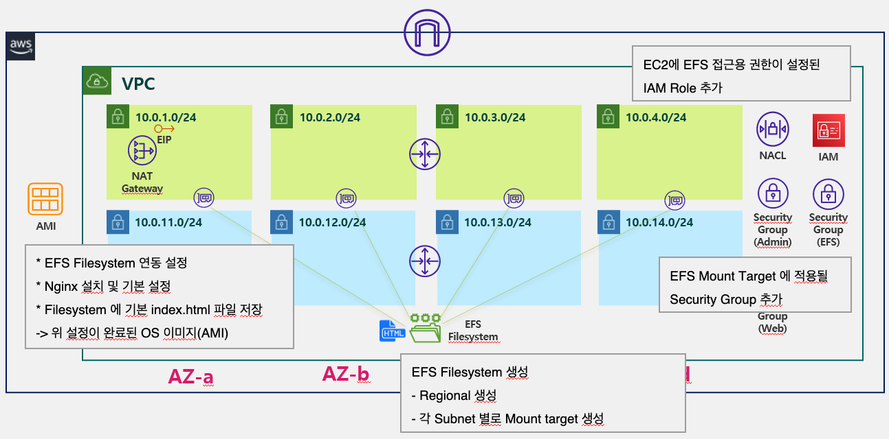

# Info
Terraform VPC + EC2 with EFS Example



#### VPC (Terraform 사용)
* VPC CIDR 은 10.0.0.0/16 
* Subnet CIDR 은 10.X.0.0/24 
* Subnet 은 본인이 선택한 Region 의 Availability Zone 수 만큼 생성 (ex. us-east-1 -> 4 Availability Zones -> 4 Subnets)
* 각 Availability Zone 별로 Public Subnet, Private Subnet 페어로 한개씩 존재하도록 생성
* Internet Gateway 생성 후 VPC 에 Attach
* Route Table 은 Public 과 Private Route Table 한개씩 총 2개 생성
* Public Route Table 은 Internet Gateway 로 통신 가능하도록 Route 추가 후 Public Subnet 4개와 연결 (Associatation)
* Private Route Table 은 Route 추가 없이 Private Subnet 4개와 연결 (Associatation)
* NAT Gateway 용 EIP 생성
* Public Subnet 에 NAT Gateway 생성
* Private Route Table 에 외부 통신을 위해서 NAT Gateway 로 통신 가능하도록 Route 추가
* SSH 허용을 위한 Admin 용 Security Group 과 HTTP 웹 접속 허용을 위한 Web Security Group, EFS 통신을 위한 EFS Security Group 총 세개의 Security Group 생성
* Admin Security Group 에는 SSH(20) 포트를 본인 Cloud9 Public IP 허용하는 Rule 생성
* Web Security Group 에는 HTTP(80) 포트를 모두 허용 하는 Rule 생성
* EFS Security Group 에는 NFS 통신을 위한 TCP(2049) 포트 허용하는 Rule 생성
* 각 Resource 를 생성하는 코드를 모두 Module 로 제작
 
#### EFS (Terraform 사용)
* EFS Filesystem 생성 
* 각 Subnet 마다 Mount Target 생성 후 EFS Security Group 적용

#### EC2 용 AMI 제작 (Manually)
* Instance 에 EFS Filesystem 사용 설정 완료된 AMI 이미지 제작
    * NFS 마운트
    * Nginx 웹서버 설치 및 설정
    * 마운트된 디렉토리에 HTML index 파일 생성
    * 위 설정이 완료된 Instance 를 AMI 로 생성


# Step

## 1. Terraform 실행

### 1) 변수 설정
efs.tfvars 파일 확인 
실행 환경에 맞게 변경

```
# efs.tfvars 파일

prefix              =       "<<YOUR_PREFIX>>"
region              =       "us-east-1"
vpc_cidr            =       "10.0.0.0/16"

public_subnets      =       [
    {cidr = "10.0.1.0/24", availability_zone = "us-east-1a"},
    {cidr = "10.0.2.0/24", availability_zone = "us-east-1b"},
    {cidr = "10.0.3.0/24", availability_zone = "us-east-1c"},
    {cidr = "10.0.4.0/24", availability_zone = "us-east-1d"},
]

private_subnets     =       [
    {cidr = "10.0.11.0/24", availability_zone = "us-east-1a"},
    {cidr = "10.0.12.0/24", availability_zone = "us-east-1b"},
    {cidr = "10.0.13.0/24", availability_zone = "us-east-1c"},
    {cidr = "10.0.14.0/24", availability_zone = "us-east-1d"},
]

admin_access_cidrs  =       ["<<YOUR_LOCAL_IP_CIDR>>"]
```

* Prefix 는 알맞게 변경
* Region 은 본인이 사용할 region 코드로 변경
* Subnet 의 Availability Zone 값은 Region 에 맞게 변경
* SSH 접속 허용할 IP 값 변경


### 2) Terraform init  
Init 명령으로 Terraform 수행을 위한 provider plugin 초기화 및 다운로드 수행

```
terraform init
```

### 4) Terraform plan  
Plan 명령으로 Terraform 수행 전 실행 시뮬레이션 확인
```
terraform apply --var-file=efs.tfvars
```  

### 5) Terraform apply  
Apply 명령으로 Terraform 을 통한 Resource 생성 수행
```
terraform apply --var-file=efs.tfvars
```  

## 3. Terraform 실행 내용 확인
* 선택한 Region 에 VPC, Subnet, Internet Gateway, Route Table, NAT Gateway, Security Group, instance 생성 내용 확인.  
* EFS Filesystem 생성 여부 확인.
* 각 Subnet에 Mount Target 생성 여부 확인.


## 4. AMI 생성
인스턴스에 EFS의 Filesystem 과 연결 하려면, OS 설정 필요.
OS 설정과 웹서버 설정이 추가된 AMI 이미지 생성. 

### 1) AMI 를 만들기 위해서 먼저 인스턴스를 배포한다.  

** Instance 정보**
* 이미지 : Ubuntu 20.04
* Instance Type: t2.micro (or t2.small)
* Network : Terraform 으로 생성된 VPC의 Public Subnet.
* Tags : Name 지정

### 2) Instance 접속
접속 후 root 유저로 전환
```
> sudo su -
```

### 3) Amazon EFS utils 설치

```
> apt update
> apt install -y binutils
> git clone https://github.com/aws/efs-utils
> cd efs-utils
> ./build-deb.sh
> sudo apt-get -y install ./build/amazon-efs-utils*deb
```


### 4) Mount 디렉토리 생성

```
> mkdir /data
```


### 5) FS Mount 

```
> sudo mount -t efs -o tls <<FILESYSTEM_ID>>:/ /data
```

Filesystem ID 는 Console 에서 확인 가능.  

```
> df -h
Filesystem      Size  Used Avail Use% Mounted on
/dev/root       7.7G  1.5G  6.3G  19% /
devtmpfs        484M     0  484M   0% /dev
tmpfs           490M     0  490M   0% /dev/shm
tmpfs            98M  852K   98M   1% /run
tmpfs           5.0M     0  5.0M   0% /run/lock
tmpfs           490M     0  490M   0% /sys/fs/cgroup
/dev/loop0       34M   34M     0 100% /snap/amazon-ssm-agent/3552
/dev/loop1       56M   56M     0 100% /snap/core18/1997
/dev/loop2       71M   71M     0 100% /snap/lxd/19647
/dev/loop3       33M   33M     0 100% /snap/snapd/11588
tmpfs            98M     0   98M   0% /run/user/1000
127.0.0.1:/     8.0E     0  8.0E   0% /data
```

마운트 된 내역 확인.  


### 6) /etc/fstab 에 파일시스템 마운트 저장


/etc/fstab 내용 편집
```
> sudo vim /etc/fstab

LABEL=cloudimg-rootfs   /        ext4   defaults,discard        0 1
<<FILESYSTEM_ID>>:/     /data    efs    defaults,_netdev        0 0
```

umount 명령으로 현재 마운트된 것 언마운트
```
> umount /data
```

mount 명령을 통해 다시 재 마운트 시행.  
/etc/fstab 에 작성 내역이 정상이면 마운트 동작 이상 없이 될 것.
```
> mount -a
```

### 7) nginx 웹서버 설치

아래 명령을 순서대로 입력
```
> sudo apt update -y
> sudo apt install -y nginx
> sudo systemctl start nginx
> sudo systemctl enable nginx
```


### 8) 웹서버 html 기본 디렉토리를 /data 디렉토리로 변경

sites-enabled/default 파일 변경
```
> vim /etc/nginx/sites-enabled/default

# sites-enabled/default

server {
    ...
    
    # root /var/www/html; -> 해당 부분 주석 처리 후 변경
    root /data/html;
    ...
}
```

### 9) /data 디렉토리에 기본 index.html 파일 생성
```
> cd /data
> mkdir html
> cd html
```


```
> vim index.html

<h1>Hello!</h1>
<h2>This is the index file currently being serviced through the EFS Filesystem.<h2>
```

### 10) nginx 재부팅
```
> systemctl restart nginx
```

nginx 서버 동작 확인

```
> systemctl status nginx
```

### 11) 웹브라우저 접속시 정상 작동 확인

해당 인스턴스의 Public IP 를 복사해 웹브라우저에서 접속 여부 확인.


### 12) AMI 생성 

Instance 선택 -> Actions -> Image and Templates -> Create Image

### 13) AMI 로 Instance 배포 확인

AMI 선택 -> Actions -> Launch  

Launch 시, Instance 생성 화면으로 전환.  

Instance Type, Tags 등을 설정 후 배포.  
*Instance 의 IAM Role 에 Terraform 으로 생성된 IAM Role 선택*  

배포 후 브라우저 접속하여 웹페이지 정상 서비스 확인.  


- - -

모든 작업이 완료되었으면, 02-ec2 로 이동하여 EC2 생성 코드를 수행해보자. [바로가기](../02-ec2)

- - - 


# Resource 삭제

*해당 삭제는 02-ec2 까지 완료한 이후 정리작업을 수행한다.*

### Terraform destroy
Destroy 명령으로 생성된 VPC 및 EFS 삭제 수행
```
terraform destroy --var-file=ebs.tfvars
```
