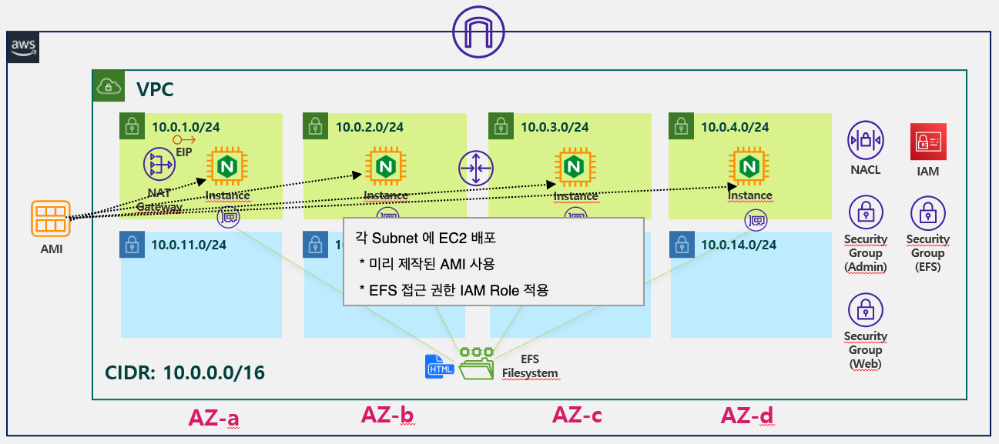

# Info
Terraform VPC + EC2 with EFS Example



#### EC2 with EFS
* 각 Public Subnet 에 이전에 생성한 AMI 로 EC2 Instance 배포

# Step

## 1. Terraform 실행

### 1) 변수 설정
efs.tfvars 파일 확인 
실행 환경에 맞게 변경

```
# efs.tfvars 파일

prefix                  =   "test"
region                  =   "us-east-1"

public_subnet_ids       =   []
ami_id                  =   "<<AMI_ID>>"
security_group_ids      =   []
instance_type           =   "t3.micro"
keypair_name            =   "<<YOUR_KEYPAIR_NAME>>"
iam_profile_name        =   "<<YOUR_IAM_PROFILE_NAME>>"

```

* Prefix 는 알맞게 변경
* Region 은 본인이 사용할 region 코드로 변경
* Public Subnet 의 01-efs 에서 생성한 Subnet 중 Public Subnet 의 ID 리스트 입력
* AMI ID 는 이전에 생성한 AMI 의 ID 입력
* Keypair 는 미리 생성 해 놓은 keypair 이름 입력


### 2) Terraform init  
Init 명령으로 Terraform 수행을 위한 provider plugin 초기화 및 다운로드 수행

```
terraform init
```

### 4) Terraform plan  
Plan 명령으로 Terraform 수행 전 실행 시뮬레이션 확인
```
terraform apply --var-file=efs.tfvars
```  

### 5) Terraform apply  
Apply 명령으로 Terraform 을 통한 Resource 생성 수행
```
terraform apply --var-file=efs.tfvars
```  

## 3. Terraform 실행 내용 확인
* 선택한 Region 에 VPC, Subnet, Internet Gateway, Route Table, NAT Gateway, Security Group, instance 생성 내용 확인.  
* EFS Filesystem 생성 여부 확인.
* 각 Subnet에 Mount Target 생성 여부 확인.
* 각 Public Subnet 에 EC2 Instance 생성 확인
* EC2 Instance 로 HTTP 접속 정상 작동 여부 확인


# Resource 삭제

### Terraform destroy
Destroy 명령으로 생성된 EC2 Instance 삭제 수행
```
terraform destroy --var-file=ebs.tfvars
```
