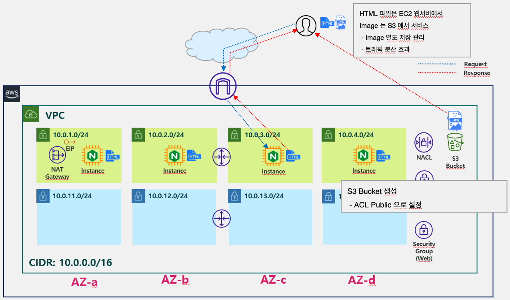

# Info
Terraform VPC + S3 + EC2 Example

#### S3
* S3 Bucket 생성 
* Bucket 생성 후 Sample 이미지 업로드 및 Public 설정

#### VPC
* VPC CIDR 은 10.0.0.0/16 
* Subnet CIDR 은 10.X.0.0/24 
* Subnet 은 본인이 선택한 Region 의 Availability Zone 수 만큼 생성 (ex. us-east-1 -> 4 Availability Zones -> 4 Subnets)
* 각 Availability Zone 별로 Public Subnet, Private Subnet 페어로 한개씩 존재하도록 생성
* Internet Gateway 생성 후 VPC 에 Attach
* Route Table 은 Public 과 Private Route Table 한개씩 총 2개 생성
* Public Route Table 은 Internet Gateway 로 통신 가능하도록 Route 추가 후 Public Subnet 4개와 연결 (Associatation)
* Private Route Table 은 Route 추가 없이 Private Subnet 4개와 연결 (Associatation)
* NAT Gateway 용 EIP 생성
* Public Subnet 에 NAT Gateway 생성
* Private Route Table 에 외부 통신을 위해서 NAT Gateway 로 통신 가능하도록 Route 추가
* SSH 허용을 위한 Admin 용 Security Group 과 HTTP 웹 접속 허용을 위한 Web Security Group 총 두개의 Security Group 생성
* Admin Security Group 에는 SSH(20) 포트를 본인 Cloud9 Public IP 허용하는 Rule 생성
* Web Security Group 에는 HTTP(80) 포트를 모두 허용 하는 Rule 생성
* 각 Resource 를 생성하는 코드를 모두 Module 로 제작

#### EC2
* 각 EC2 Instance 생성 후, User data 를 통해 Nginx 웹서버 설치 및 index.html 테스트 웹 파일 생성
* index.html 에  태그로 S3 의 이미지 URL 추가

# Step

Terraform 코드를 두번으로 나누어 각각 실행한다. 
* [01-s3](./01-s3) : S3 Bucket 생성 모듈 포함
* [02-ec2](./02-ec2): VPC 생성 및 네트워크 설정가 EC2 배포 모듈 포함

먼저 01-s3 디렉토리로 이동하여 Terraform 실행 수행.  
S3 Bucket이 준비되면, 해당 Bucket 에 Sample 이미지 업로드.
02-ec2 디렉토리로 이동하여 Terraform 실행 수행.
