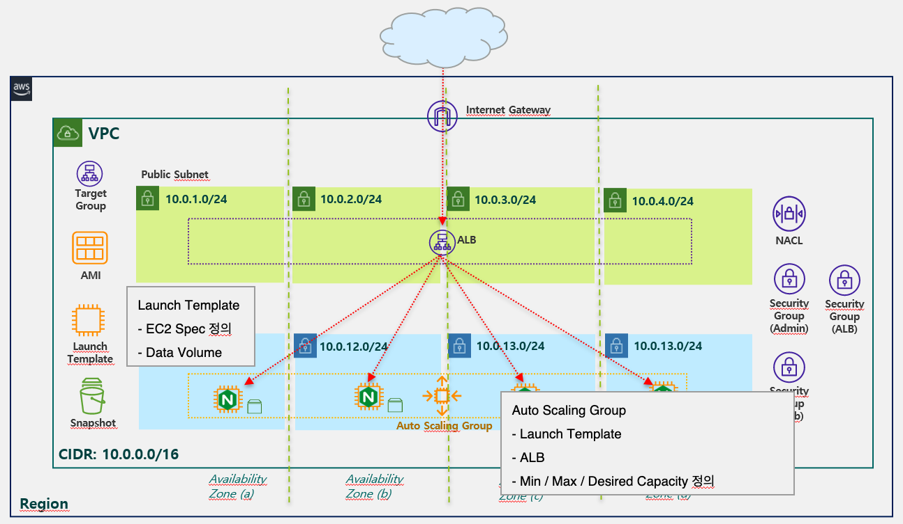

# Info
Terraform VPC + Auto Scaling Group + ALB Example



#### VPC
* VPC CIDR 은 10.0.0.0/16 
* Subnet CIDR 은 10.X.0.0/24 
* Subnet 은 본인이 선택한 Region 의 Availability Zone 수 만큼 생성 (ex. us-east-1 -> 4 Availability Zones -> 4 Subnets)
* 각 Availability Zone 별로 Public Subnet, Private Subnet 페어로 한개씩 존재하도록 생성
* Internet Gateway 생성 후 VPC 에 Attach
* Route Table 은 Public 과 Private Route Table 한개씩 총 2개 생성
* Public Route Table 은 Internet Gateway 로 통신 가능하도록 Route 추가 후 Public Subnet 4개와 연결 (Associatation)
* Private Route Table 은 Route 추가 없이 Private Subnet 4개와 연결 (Associatation)
* NAT Gateway 용 EIP 생성
* Public Subnet 에 NAT Gateway 생성
* Private Route Table 에 외부 통신을 위해서 NAT Gateway 로 통신 가능하도록 Route 추가
* SSH 허용을 위한 Admin 용 Security Group 과 HTTP 웹 접속 허용을 위한 Web Security Group 총 두개의 Security Group 생성
* Admin Security Group 에는 SSH(20) 포트를 본인 Cloud9 Public IP 허용하는 Rule 생성
* Web Security Group 에는 HTTP(80) 포트를 모두 허용 하는 Rule 생성
* 각 Resource 를 생성하는 코드를 모두 Module 로 제작

#### ALB
* ALB 및 Target Group
* Target Group 은 비워놓은 채 생성

#### Auto Scaling Group
* Launch Template 생성
    * AMI ID: 기존 08-ec2 챕터에서 생성한 AMI 의 ID
    * Data Volume: 기존 08-ec2 챕터에서 생성한 Data Volume 의 스냅샷 ID
    * EC2 instance 에 설정할 keypair 명 설정
    * Security Group: Web, Admin Security Group 설정
* Auto Scaling Group 생성
    * 위에서 생성한 Launch Template 설정
    * 위에서 생성한 ALB 설정
    * Min(1)/Max(4)/Desired Capacity(2) 설정

# Step

## 1. 변수 설정
auto_scaling_group.tfvars 파일 확인 
실행 환경에 맞게 변경  

```
# auto_scaling_group.tfvars 파일

prefix                  =       "<<YOUR_PREFIX>>"
region                  =       "us-east-1"
vpc_cidr                =       "10.0.0.0/16"

public_subnets          =       [
    {cidr = "10.0.1.0/24", availability_zone = "us-east-1a"},
    {cidr = "10.0.2.0/24", availability_zone = "us-east-1b"},
    {cidr = "10.0.3.0/24", availability_zone = "us-east-1c"},
    {cidr = "10.0.4.0/24", availability_zone = "us-east-1d"},
]

private_subnets         =       [
    {cidr = "10.0.11.0/24", availability_zone = "us-east-1a"},
    {cidr = "10.0.12.0/24", availability_zone = "us-east-1b"},
    {cidr = "10.0.13.0/24", availability_zone = "us-east-1c"},
    {cidr = "10.0.14.0/24", availability_zone = "us-east-1d"},
]

admin_access_cidrs      =       ["<<YOUR_LOCAL_IP_CIDR>>"]

image_id                =       "<<YOUR_AMI_ID>>"
data_vol_snapshot_id    =       "<<DATA_VOLUME_SNAPSHOT_ID>>"
data_volume_size        =       "10"

instance_type           =       "t3.micro"
keypair_name            =       "<<YOUR_KEYPAIR_NAME>>"

port                    =       "80"
protocol                =       "HTTP"

min_size                =       1
max_size                =       4
desired_capacity        =       2
```

* Prefix 는 알맞게 변경
* Region 은 본인이 사용할 region 코드로 변경
* Subnet 의 Availability Zone 값은 Region 에 맞게 변경
* admin access CIDR : SSH 접속 허용할 IP 값 변경 
* AMI ID: 기존 08-ec2 챕터에서 생성한 AMI 의 ID
* Data Volume Snapshot ID: 기존 08-ec2 챕터에서 생성한 Data Volume 의 스냅샷 ID
* EC2 instance 에 설정할 keypair 명 설정
* ALB 에서 Instance 로 서비스될 트래픽의 포트(80)와 프로토콜(HTTP)

## 2. init  
Init 명령으로 Terraform 수행을 위한 provider plugin 초기화 및 다운로드 수행

```
terraform init
```

## 3. plan  
Plan 명령으로 Terraform 수행 전 실행 시뮬레이션 확인
```
terraform apply --var-file=auto_scaling_group.tfvars
```  

## 4. apply  
Apply 명령으로 Terraform 을 통한 Resource 생성 수행
```
terraform apply --var-file=auto_scaling_group.tfvars
```  

## 5. 실행 내용 확인
선택한 Region 에 VPC, Subnet, Internet Gateway, Route Table, NAT Gateway, Security Group, instance 생성 내용 확인.    
Auto Scaling Group 확인.  
생성된 ALB 와 Target Group 확인. Target Group 에 소속된 Instance 의 Status Healty 확인.  
ALB 의 DNS name 으로 웹브라우저 접속 정상 확인.  
웹브라우저 refresh 시, 정상적인 Balancing 접속 확인.  


# Resource 삭제

## 1. destroy
Destroy 명령으로 생성된 Auto Scaling Group, ALB 및 VPC 삭제 수행
```
terraform destroy --var-file=auto_scaling_group.tfvars
```
